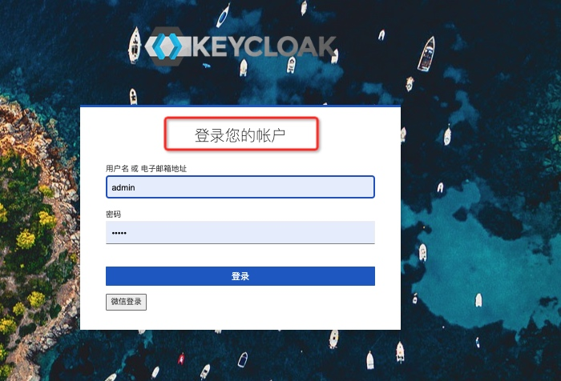

# 工程简介

本项目是一个基于SpringBoot嵌套容器启动keycloak-service的示例Demo，Demo演示了以下内容

- 自定义页面
- 自定义国际化内容
- 自定义登录方式
    - 企业微信登录（待定）

### 环境版本

- keycloak : 18.0
- springboot: 2.6.7
- JDK：11

### 快速开始

- 启动项目后，直接打开🔗 [http://localhost:8080/auth/](http://localhost:8080/auth/)
- 点击Administration Console 进入控制台
- 登录名/密码：admin/admin
    - 超级管理员账号密码可以在application.yml 中的 adminUser 属性设置

# 延伸阅读

### 一、如何自定义Keycloak登录页面？

**在了解如何自定义Keycloak登录页面前，首先我们需要了解一下keycloak自定义页面的原理。**

keycloak提供了网页的主题支持，并且允许用户按照自己需求自定义主题。
它可以支持以下几个模块的主题自定义：
- 账户管理模块
- 管理控制台模块
- 登录表单
- 欢迎页面

一个主题通常包括以下几个内容：
- HTML templates (Freemarker Templates)
- Images（页面需要的图片）
- Message bundles（国际化内容）
- Stylesheets（css样式）
- Scripts（js 脚本）
- Theme properties（主题设置）

在resources的目录如下

```
resources
└── theme
    └── mytheme                                 // 自定义主题名称，可以自己取
        └── login                               // 登录模块，参考官方源码或者文档
            ├── login.ftl                       // 自定义登录页面的内容
            ├── messages                        // 国际化的消息包
            │   └── messages_zh_CN.properties   // 用户自定义的国际化消息   
            ├── resources
            │   ├── css                         // 用户自定义的css
            │   │   └── mylogin.css
            │   ├── img                         // 用户自定义的图片
            │   │   └── login-bg.jpg
            │   └── js                          // 用户自定义的js
            │       └── script.js
            └── theme.properties                // 主题设置，它可以导入一些公共资源（js,css，freemarker的参数等），提供给页面使用

```

当我们按照上述目录的格式，将自己的自定义页面添加好后，我们需要打开Administration Console 进入控制台，

- 选择Realm Settings -> Themes ，我们会看到用户自定义主题mytheme，选中后保存，刷新页面后，打开keycloak的登录页面我们就可以看到用户自定义的页面啦。。。


### 二、如何自定义国际化内容？

**keycloak 默认是支持中文汉化，但汉化的并不齐全，我们可以在Realm Settings -> Theme，设置Internationalization Enabled 为true 开启国际化，设置Supported Locales 选择我们需要的语言。**

- 我们以中文汉化为例，我们只需要在messages目录下加入messages_zh_CN.properties文件，并且设置国际化的内容。

```
# encoding: utf-8
loginAccountTitle=登录您的帐户
```

- 更改完成，重启项目后，我们将Supported Locales 设置为zh就能看到自己汉化的内容了。




- messages_zh_CN.properties 的自定义属性，我是参考[keycloak源码](https://github.com/keycloak/keycloak.git) 中`/themes/src/main/resources-community/theme/base/login/messages/messages_zh_CN.properties`文件。
- 当然想适配其他的语言，处理的逻辑也是一样的。


# 参考文献：

- [官方文档 - keycloak自定义主题](https://www.keycloak.org/docs/18.0/server_development/index.html#_themes)
- [embedded-keycloak-server-custom](https://github.com/thomasdarimont/embedded-spring-boot-keycloak-server/tree/master/embedded-keycloak-server-custom)
